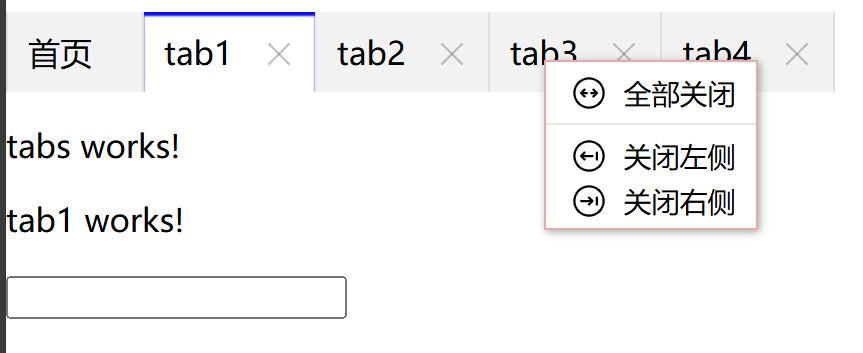

# z-ngx-tabs

This project was generated using [Angular CLI](https://github.com/angular/angular-cli) version 19.0.3.

这个项目支持的最低angular版本是19.0.1

一款简单好用的Tab组件.



#### **z-ngx-tabs的亮点：**
1. 第一支持大数据量多标签页展示，动态监测tab页容器的宽度变化，当宽度超过容器时，自动出现滚动切换按钮。
2. 第二支持使用路由复用，当tab切换时，路由数据还可以保存，例如填写表单后，又进行tab页切换，当切换回来时，表单数据依然保存。
3. 第三支持使用右键操作面板，可以进行批量标签关闭。

## 使用

### **安装**

#### **npm命令安装**

```shell
npm i z-ngx-tabs
```


### **示例**

#### **快速使用**
使用模块的component.html页面：
```html
 <z-ngx-tabs [datasource]="datasource" (activeTab)="activeTab($event)" (closeTab)="closeTab($event)" ></z-ngx-tabs>
```
使用模块的component.ts页面
```javascript
import {ITabType, TabsComponent} from 'z-ngx-tabs';
...

datasource: Array<ITabType> = [
  {id: "home", title: "首页", path: "/home",active:true},
  {id: "tab1", title: "tab1", canClose: true, path: "/tabs/tab1",ignoreStrong:true},
  {id: "tab2", title: "tab2", canClose: true, path: "/tabs/tab2"},
  {id: "tab3", title: "tab3", canClose: true, path: "/tabs/tab3"},
  {id: "tab4", title: "tab4", canClose: true, path: "/tabs/tab4"},
]

activeTab(id: string) {
  console.log(id)
}

closeTab(ids: string[]) {
  console.log(ids)

}
```
使用项目的app.config.ts文件
```javascript
import {SimpleReuseStrategy} from 'z-ngx-tabs';
...

export const appConfig: ApplicationConfig = {
  providers: [
    ...
    {provide: RouteReuseStrategy, useClass: SimpleReuseStrategy}, // 提供z-ngx-tabs提供的路由复用策略
  ]
};
```


#### 属性简单说明
| 参数     | 类型         | 默认                  | 必填 | 说明                      |
|--------|------------|---------------------|----|-------------------------|
| datasource   | ITabType[] |                     | 必填 | 加载tab组件的必要属性参数，tab页的数据源 |
| activeTab | 事件函数       | (id) => void (0)        | 可选 | 激活tab页的事件，返回激活tab的id    |
| closeTab  | 事件函数       | (ids[]) => void (0) | 可选 | 关闭tab的事件，返回关闭tab的id     |

#### ITabType接口
```javascript
export interface Option {
export interface ITabType {
      id: string,  //必须，id请尽量使用UUID,因为要在url中寻找这个id，来判断唯一性,禁止使用1，2，3，a,b,c这类简单id
      title: string, //必须，tab的标题
      path: string,  //必须，tab页面的路由地址
      canClose?: boolean, //可选，默认：false,tab是否能关闭
      active?: boolean,   //可选，默认：false,当前tab是否激活
      ignoreStrong?: boolean //可选，默认：false,当前tab是否忽略缓存
  }
}
```
## 版本
**现在最新版是0.0.3**

- **0.0.3** `最新`
  完善文档

- **0.0.2** `历史`
  完善组件，完善文档

- **0.0.1** `过期`
  完成了tabs组件的构建，满足基本的项目需求
